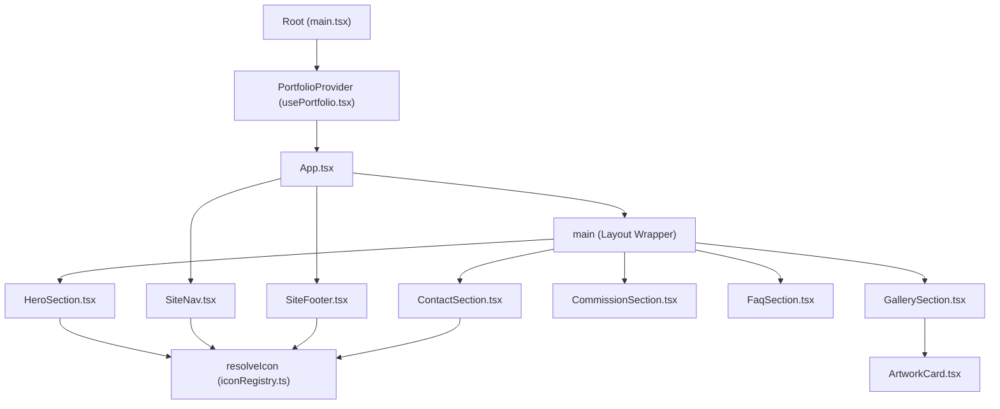
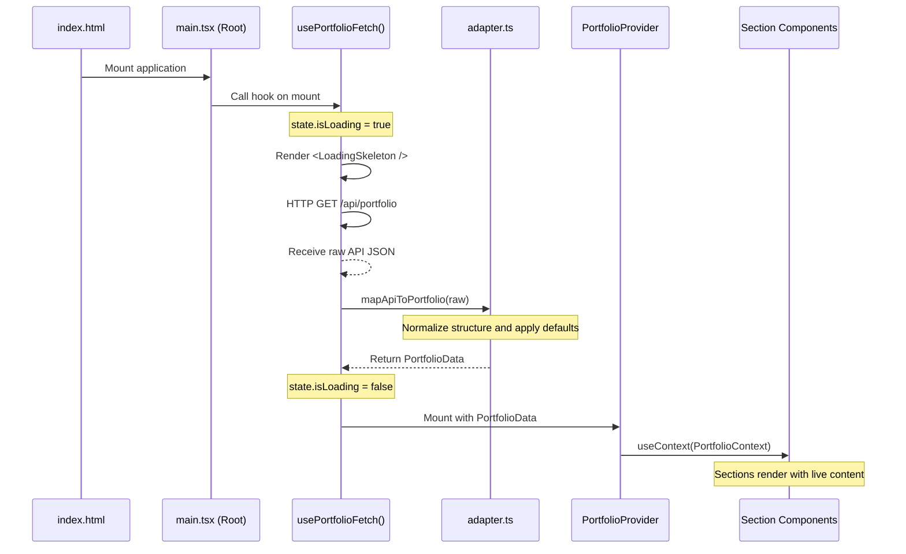

<div align="center">

# Cloudy Artist Portfolio

**A high-performance, responsive single-page artist portfolio featuring modern typography, custom viewport scroll-tracking, hand-drawn vector elements, and dynamic animations.**

Built with React 19 | TypeScript 6 | Tailwind CSS v4 | Vite 8 | Framer Motion 12

[Architecture](#architecture) | [Getting Started](#getting-started) | [Replication Guide](#replication-guide) | [API Reference](#api-reference) | [Styling & Design](#styling--design)

---

</div>

## Table of Contents

- [Overview](#overview)
- [Architecture](#architecture)
  - [Component Hierarchy](#component-hierarchy)
  - [Data Hydration Layer](#data-hydration-layer)
  - [Dynamic Section Tracking](#dynamic-section-tracking)
  - [Headless CMS Integration](#headless-cms-integration)
- [Technology Stack](#technology-stack)
- [Project Structure](#project-structure)
- [Getting Started](#getting-started)
  - [Prerequisites](#prerequisites)
  - [Local Development](#local-development)
  - [Available Scripts](#available-scripts)
  - [Production Deployment](#production-deployment)
- [Replication Guide](#replication-guide)
  - [Phase 1 -- Foundation & Config](#phase-1----foundation--config)
  - [Phase 2 -- Layout & Active Section Observer](#phase-2----layout--active-section-observer)
  - [Phase 3 -- Content Hydration & API Clients](#phase-3----content-hydration--api-clients)
  - [Phase 4 -- Styling, Typography, and Keyframe Animations](#phase-4----styling-typography-and-keyframe-animations)
  - [Phase 5 -- Production Build & Assets](#phase-5----production-build--assets)
- [API Reference](#api-reference)
- [License](#license)

---

## Overview

Cloudy Artist Portfolio is the public-facing side of the Cloudy artist management platform. It renders a clean, single-page presentation layout configured dynamically by the headless CMS backend (via the Cloudy Admin UI). 

### Core Capabilities

| Capability | Description |
|---|---|
| **Headless Hydration** | Loads all text, configuration, navigation, gallery assets, and contact form rules from the API. |
| **Scroll-Tracking Header** | Navigation links dynamically highlight based on the section currently occupying the majority of the viewport. |
| **Micro-Animations** | Uses GPU-accelerated Tailwind transitions and Framer Motion spring curves for physical-feeling hover states. |
| **Keyframe Backgrounds** | Hand-drawn SVG assets decorated with CSS-animated stars, floating particles, and rotating orbit rings. |
| **Adaptive Layouts** | Fully responsive from narrow mobile touch devices to wide desktop displays. |
| **SVG Icon Resolution** | Dynamically resolves custom uploaded URLs or resolves named entries out of the Phosphor icon system. |

---

## Architecture

### Component Hierarchy

The application runs as a single-page app (SPA) with a top-down data context provider distributing configuration to the section wrappers.



---

### Data Hydration Layer

During initial rendering, the application executes a asynchronous fetch request to `/portfolio` to retrieve database configuration.



If the API is unreachable, the hydration hook catches the error and falls back to a locally cached default data profile (`src/content/portfolio.ts`), allowing the UI to remain fully functional offline or during server configuration.

---

### Dynamic Section Tracking

Rather than relying on simple browser intersection observers that trigger sequentially, `App.tsx` runs a custom layout tracker on scroll and resize events. It computes intersection overlaps:

1. Subscribes to window `scroll` and `resize` events (debounced via `requestAnimationFrame`).
2. Measures the bounding rectangles (`getBoundingClientRect`) of each section mapped in the navigation.
3. Calculates vertical overlap with the active viewport (excluding header height).
4. Highlights the navigation link of the section that occupies the largest percentage of the viewport.
5. Implements a scroll-to-bottom override to guarantee the final section (Contact) is highlighted when the user reaches the end of the page.

---

### Headless CMS Integration

When embedded as an `iframe` inside the Cloudy Admin UI, the portfolio supports real-time editing previews. 

The preview bridge works as follows:
- The parent Admin UI proxy injects a script into the header of the portfolio preview.
- This script intercepts standard `window.fetch` calls.
- When the parent posts draft updates via `window.postMessage`, the script intercepts the payload and caches it.
- When the application calls `fetchPortfolio()`, the intercepted fetch handler resolves immediately with the cached draft configuration instead of requesting it from the backend API.
- This allows real-time UI updates to be visible without saving or publishing to the database.

---

## Technology Stack

| Category | Technology | Version | Purpose |
|---|---|---|---|
| **Framework** | React | 19.x | Component structure and state lifecycle |
| **Language** | TypeScript | 6.x | Static typing and type safety |
| **Build Tool** | Vite | 8.x | HMR, dev server, and asset compiling |
| **Styling** | Tailwind CSS | v4.x | Design tokens, flex layouts, and styles |
| **Animations** | Framer Motion | 12.x | Springs, stagger lists, and scroll fades |
| **Icons** | Phosphor Icons | 2.x | Vector icon system |

---

## Project Structure

```
CloudyArtistPortfolio/
├── public/
│   ├── favicon.ico
│   ├── pastel-cloud-pattern.svg    # Hand-drawn background clouds
│   └── Panel Full/                 # Custom hand-drawn section dividers
│       ├── panel-full_char-intro.svg
│       ├── panel-full_contact.svg
│       └── ...
├── src/
│   ├── assets/                     # Local static images (watermarks, character keys)
│   ├── components/
│   │   ├── ArtworkCard.tsx         # Individual gallery asset card
│   │   ├── LoadingSkeleton.tsx     # Animated shimmer overlay used on initial load
│   │   ├── motion.tsx              # Framer Motion container configuration
│   │   ├── SectionHeading.tsx      # Section divider with custom SVG artwork
│   │   ├── SiteFooter.tsx          # Dynamic site footer with social links
│   │   └── SiteNav.tsx             # Responsive header with scroll tracking
│   ├── content/
│   │   ├── adapter.ts              # Normalizes backend API database records
│   │   ├── api.ts                  # Axios/Fetch client for retrieving configuration
│   │   ├── apiTypes.ts             # Typings reflecting raw backend database schemas
│   │   ├── iconRegistry.ts         # Maps strings to Phosphor Icon references
│   │   ├── portfolio.ts            # Fallback configuration structure
│   │   ├── types.ts                # Mapped/adapted frontend type shapes
│   │   └── usePortfolio.tsx        # React Context provider & hydration hooks
│   ├── sections/
│   │   ├── CommissionSection.tsx   # Detailed commission tiers and guidelines
│   │   ├── ContactSection.tsx      # Dynamic contact fields with action URL
│   │   ├── FaqSection.tsx          # Accordion-style FAQ items and TOS terms
│   │   ├── GallerySection.tsx      # Interactive masonry art gallery
│   │   └── HeroSection.tsx         # Greeting banner with CTA buttons
│   ├── App.css                     # Custom component override rules
│   ├── App.tsx                     # Main layout coordinator & scroll monitor
│   ├── index.css                   # Tailwind v4 import, fonts, keyframes
│   └── main.tsx                    # Mount root and provider wrappers
├── eslint.config.js
├── package.json
├── vite.config.ts                  # Vite bundle configuration with tailwind/vite integration
└── tsconfig.json
```

---

## Getting Started

### Prerequisites

- **Node.js** 20.x or later
- **npm** 10.x or later
- Access to the Cloudy Admin API (or mock JSON endpoint matching the schema)

### Local Development

1. **Clone the repository and install dependencies:**
   ```bash
   git clone <repository-url>
   cd CloudyArtistPortfolio
   npm install
   ```

2. **Run the local development server:**
   ```bash
   npm run dev
   ```

The application will start on `http://localhost:5173`. Any changes to files will instantly hot-reload in the browser.

### Available Scripts

| Script | Command | Description |
|---|---|---|
| `dev` | `npm run dev` | Runs the Vite development server |
| `build` | `npm run build` | Compiles TypeScript and builds the production bundle |
| `lint` | `npm run lint` | Analyzes code for quality and style guidelines |
| `preview` | `npm run preview` | Runs the built production bundle locally |

### Production Deployment

The project can be deployed directly to Vercel, Netlify, or any static hosting platform.

```bash
# Build the production bundle
npm run build
```

This compiles typescript assets and writes a highly optimized, minified HTML/JS bundle to the `dist/` directory.

---

## Replication Guide

Follow this guide to build a similar client-side portfolio using headless content delivery.

### Phase 1 -- Foundation & Config

1. **Initialize the application:**
   ```bash
   npx -y create-vite@latest ./ --template react-ts
   npm install @tailwindcss/vite tailwindcss framer-motion @phosphor-icons/react
   ```

2. **Configure Tailwind v4** in `vite.config.ts`:
   ```typescript
   import { defineConfig } from 'vite'
   import react from '@vitejs/plugin-react'
   import tailwindcss from '@tailwindcss/vite'

   export default defineConfig({
     plugins: [react(), tailwindcss()],
   })
   ```

3. **Verify CSS imports** in `src/index.css`:
   ```css
   @import "tailwindcss";
   ```

### Phase 2 -- Layout & Active Section Observer

1. **Configure layout wrappers** in `App.tsx` and place empty component shells for your sections.
2. **Implement section tracking** inside a `useEffect` inside `App.tsx`. Calculate scroll positions, loop through DOM elements, compare bounding overlaps, and map the currently active layout to a navigation state.

### Phase 3 -- Content Hydration & API Clients

1. **Model the data**: Establish types for the payload in `src/content/apiTypes.ts`.
2. **Build the adapter**: Create `src/content/adapter.ts` to map database structure to frontend layout properties (e.g. converting `imageUrl` string keys to local properties, setting up fallback values for missing array lists).
3. **Establish Context**: Create the context and provider in `src/content/usePortfolio.tsx`. Wrap the mounting root inside `main.tsx` to ensure data resolves prior to mounting layout elements.

### Phase 4 -- Styling, Typography, and Keyframe Animations

1. **Incorporate Typography** in `src/index.css`:
   ```css
   @import url('https://fonts.googleapis.com/css2?family=Libre+Baskerville:wght@400;700&family=Space+Grotesk:wght@400;500;600;700&display=swap');
   ```
2. **Establish Custom Tokens**: Declare fonts, base colors, utility classes, and custom variables inside `@layer utilities` block in `src/index.css`.
3. **Declare Keyframes**: Implement fluid animations for background decorations:
   - Floating animations (`hero-float` shifting TranslateY bounds).
   - Radial glow adjustments (`hero-glow` scaling opacity).
   - Drift paths (`sparkle-drift` utilizing multi-directional translation percentages).

### Phase 5 -- Build and Deployment

1. Run verification checks:
   ```bash
   npm run build
   ```
2. Setup environment keys for public hosting variables.

---

## API Reference

The client hydrates its configuration from a single GET request endpoint.

### Retrieve Portfolio Config

* **URL:** `/portfolio`
* **Method:** `GET`
* **Headers:** `Content-Type: application/json`
* **Success Response:**
  * **Code:** `200 OK`
  * **Payload Schema:**
    ```json
    {
      "success": true,
      "data": {
        "siteConfig": {
          "siteName": "Cloudy",
          "siteSubtitle": "Illustration & Character Art",
          "pageTitle": "Cloudy - Portfolio",
          "metaDescription": "Artist Portfolio Site",
          "logoIcon": "Sparkle"
        },
        "nav": [
          { "id": "home", "label": "Home", "icon": "House" }
        ],
        "socials": [
          { "platform": "twitter", "url": "https://twitter.com/cloudy", "label": "Twitter", "icon": "TwitterLogo" }
        ],
        "heroContent": {
          "pillIcon": "Sparkle",
          "pillLabel": "Open for Commissions",
          "eyebrow": "Welcome",
          "headline": "Hi, I'm Cloudy",
          "body": "I draw cute anime girls and characters.",
          "accent": "Featured Artwork",
          "image": "https://cdn.example.com/avatar.png",
          "imageAlt": "Cloudy Avatar",
          "statusPillLabel": "Available",
          "ctaButtons": [
            { "label": "View Gallery", "href": "#gallery", "variant": "primary", "icon": "Image" }
          ]
        },
        "gallerySection": {
          "eyebrow": "My Work",
          "title": "Art Gallery",
          "description": "A collection of recent illustrations."
        },
        "artworks": [
          { "_id": "art_1", "title": "Illustration 1", "category": "original", "description": "", "imageUrl": "https://cdn.example.com/art1.png", "altText": "Original illustration" }
        ],
        "commissions": {
          "section": {
            "eyebrow": "Pricing",
            "title": "Commissions",
            "description": "Commission guidelines and pricing."
          },
          "featured": {
            "tag": "Hot",
            "badge": "Popular",
            "title": "Chibi Illustration",
            "description": "Full color chibi character.",
            "highlights": ["1 Character", "Transparent Background"]
          }
        },
        "commissionTiers": [
          { "name": "Bust Up", "priceLabel": "$45", "detailTag": "Personal Use", "description": "Fully colored bust-up illustration." }
        ],
        "faqPage": {
          "section": {
            "eyebrow": "FAQ & Rules",
            "title": "Guidelines",
            "description": "Frequently asked questions and terms of service."
          },
          "faqHeading": "Frequently Asked Questions",
          "tosHeading": "Terms of Service",
          "tosAcceptanceText": "By commissioning me, you agree to these terms."
        },
        "faqItems": [
          { "question": "How long does it take?", "answer": "Usually 2-4 weeks depending on queue." }
        ],
        "tosSections": [
          { "heading": "General Terms", "variant": "rules", "points": ["I reserve the right to decline any request."] }
        ],
        "contactContent": {
          "section": {
            "eyebrow": "Say Hello",
            "title": "Contact Me",
            "description": "Get in touch for business inquiries or commissions."
          },
          "infoCard": {
            "tag": "Inquire",
            "title": "Let's Work Together",
            "description": "Fill out the form or email me directly.",
            "notes": ["Response time: 48 hours"]
          },
          "form": {
            "fields": [
              { "name": "name", "label": "Your Name", "type": "text", "placeholder": "Name" }
            ],
            "submitLabel": "Submit Inquiry",
            "submitIcon": "PaperPlane",
            "disclaimer": "All fields are required.",
            "actionUrl": "https://formspree.io/f/example"
          }
        },
        "footerContent": {
          "copyright": "© 2026 Cloudy. All rights reserved.",
          "tagline": "Handcrafted with love."
        }
      }
    }
    ```

---

## License

This project is private and not licensed for redistribution.
