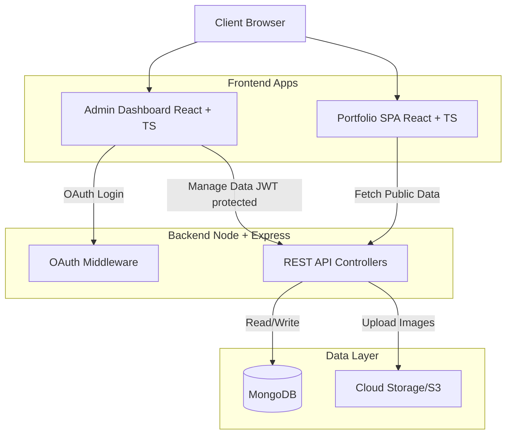
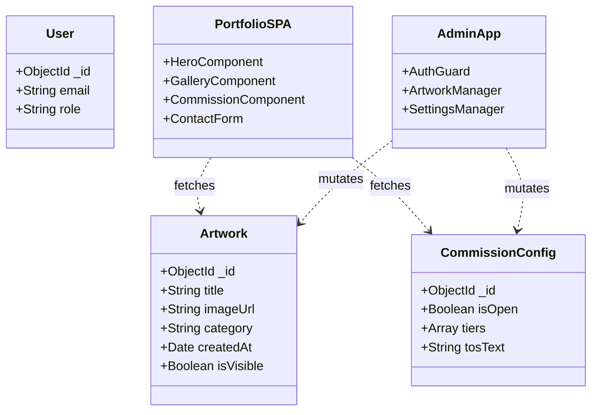
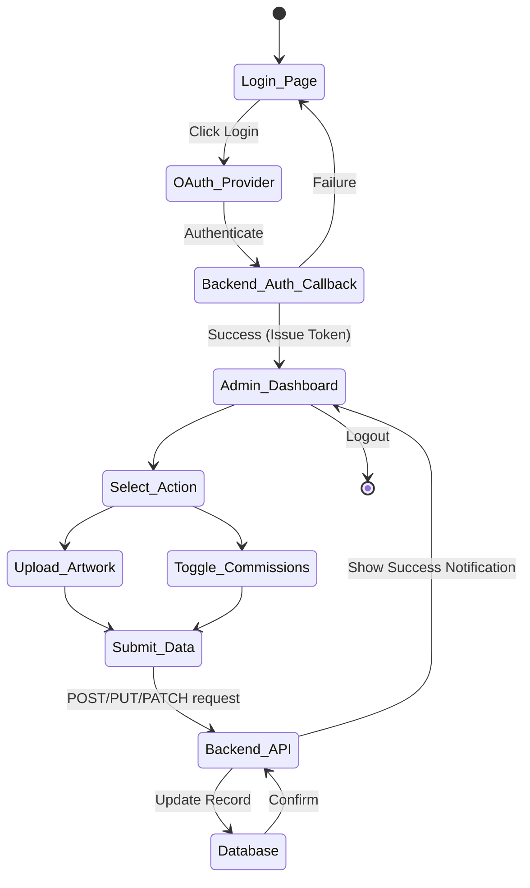

# Software Requirements Specification & Architecture Document

**Project:** Cluwudy's Portfolio
**Stack:** React + TypeScript (Frontend), Node.js + Express (Backend), MongoDB (Database)

## 1. Design System & UI/UX Guidelines

Based on the provided style reference, the application will adhere strictly to the following design system.

### Color Palette

* **Primary:** `#2D7DFF` (Used for primary buttons, active states, progress indicators, and key accents)
* **Secondary:** `#E0F2FF` (Used for background tints, secondary button backgrounds, and soft highlighting)
* **Tertiary:** `#FFFFFF` (Main background color and container backgrounds)
* **Neutral:** `#4A5568` (Used for primary text, dark mode inverted elements, and inactive states)

### Typography

* **Headlines:** Libre Baskerville (Serif) - Adds an elegant, artistic touch suitable for a portfolio.
* **Body & Labels:** Space Grotesk (Sans-serif) - Clean, highly legible for descriptions, interface elements, and navigation.

---

## 2. Software Requirements Specification (SRS)

### 2.1 Overview

Cluwudy's portfolio is a Single Page Application (SPA) designed to showcase artwork, handle commission inquiries, and provide essential information (FAQ, TOS). It includes a secure administrative dashboard for the site owner to manage content dynamically without touching the codebase.

### 2.2 Functional Requirements

**Client-Facing Portfolio (SPA):**

* **Navigation:** Persistent navigation (sticky or floating) to scroll to different sections.
* **Title/Hero Section:** Landing area with the artist's name, brief introduction, and a call-to-action (e.g., "View Artwork" or "Commission Me").
* **Artwork Gallery:** A dynamic, masonry or grid-style gallery fetching images from the backend.
* **Commissions Section:** Displays current commission status (Open/Closed), available tiers, pricing, and examples.
* **FAQ & TOS:** Text-based sections outlining the rules of engagement, usage rights, and common questions.
* **Contact:** A form allowing users to send messages or commission requests directly to the artist's email or a database queue.

**Administrative Dashboard:**

* **Authentication:** OAuth integration (e.g., Google or GitHub) restricted to the owner's specific email address.
* **Artwork Management:** Ability to upload, edit, reorder, and delete portfolio images.
* **Commission Management:** Toggle commission status and update pricing/tiers.
* **API Endpoints:** RESTful API built with Node/Express to handle all CRUD operations, protected by JWT or session tokens generated post-OAuth.

### 2.3 Non-Functional Requirements

* **Responsiveness:** Fluid design accommodating both mobile and desktop views seamlessly.
* **Animations:** Smooth transitions and micro-interactions utilizing Framer Motion. Elements should fade/slide in on scroll.
* **Performance:** Images must be optimized (e.g., WebP format) and lazy-loaded to ensure fast load times, especially for the gallery.

---

## 3. Architecture Document

### 3.1 High-Level Design (HLD)

The system follows a standard client-server architecture. The frontend is a static React application that consumes a RESTful Node.js API. The backend interacts with a MongoDB cluster to persist metadata, configuration, and image URLs (images themselves should ideally be stored in an S3-compatible object storage, referenced by the database).

### 3.2 Low-Level Design (LLD)

The LLD focuses on the component structure of the React frontend and the data models in MongoDB.

### 3.3 Activity Diagram: Admin Content Update

This diagram illustrates the flow when the owner updates the portfolio.

---

## 4. Design Notes & Accents

To ensure the site feels premium and visually interesting without being overwhelming, implement the following details:

* **Typography Contrast:** Use Libre Baskerville for massive, high-contrast section headers (e.g., a large *Artwork* fading in behind the grid). Use Space Grotesk for the functional UI to keep it strictly readable.
* **Framer Motion Implementation:** * Do not animate everything. Animate the initial page load (staggered fade-up for the nav and hero text).
* Use scroll-triggered animations (e.g., `whileInView`) for the artwork grid so images subtly scale up (`scale: 0.95` to `1`) and fade in as the user scrolls down.

* **Use of Primary Color (#2D7DFF):** Keep the background tertiary/neutral. Use the primary blue strictly for accents: text selection highlight color, an animated underline on the active navigation link, and the primary call-to-action button (like "Send Message" or "Request Commission").
* **Glassmorphism/Layering:** Since it is a SPA, make the sticky navigation bar slightly translucent with a background blur (`backdrop-filter: blur(8px)`) using the secondary color (#E0F2FF) at a low opacity. This creates depth as artwork scrolls underneath it.
* **Hover States:** When hovering over artwork in the desktop view, dim the image slightly with the neutral color (#4A5568) and slide up the title of the piece. Mobile view should display titles cleanly below or via a tap interaction.